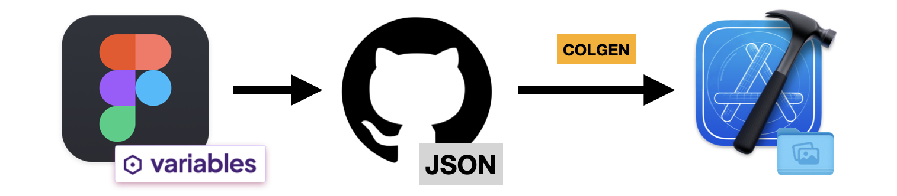

# Colgen 




Colgen is a simple CLI tool that **automates color updates** between Figma and Xcode. Instead of manually updating colors in Xcode every time a designer makes a change, Colgen pulls the latest colors from Figma and **automatically updates your Xcode Asset Catalog**.

Designers export colors using the **Token Studio plugin**, and Colgen takes care of the rest—fetching the latest color definitions from GitHub and ensuring everything stays up to date.

**Why does this tool exist?** Check out [Figma vs. Xcode](Readme_figma_vs_xcode.md) to learn how color management differs between the two and how automation simplifies the process.

## Table of contents

* [Requirements](#requirements)
* [Getting started](#getting-started)
* [Usage](#usage)
* [Contributing](#contributing)
* [License](#license)
* [Credits](#credits)

## Requirements

- macOS 15 or later
- Xcode 15 or later

## Getting started

#### Prepare Figma and Xcode project
*(skip if someone has already done this)*

- [a) Prepare Figma file and storage repo](Readme_setup_prepare_figma.md)
- [b) Prepare your Xcode project for Colgen](Readme_setup_prepare_xcode.md)

#### Install CLI

You can install Colgen via [Homebrew](https://brew.sh):

```bash
brew install infinum/ios-figma-token-generator/colgen
```

To install a specific version, use the tagged formula:

```bash
brew install infinum/ios-figma-token-generator/colgen@0.9.0
```

#### Authentication

Before you can run Colgen, you must [Configure the Personal Access Token](Readme_setup_authentication) - `COLGEN_TOKEN`.

## Usage

To pull the latest colors into your Xcode project, navigate to your project root and run:

```bash
colgen generate
```

Colgen will fetch the colors and generate an Xcode Asset Catalog (.xcassets) automatically.

Tip: Optionally, add the `-l` flag to print the complete list of primitive/semantic colors.
Warning: **Do not manually edit the `.xcassets` folder**—it will be **overwritten** each time you run Colgen.

## Contributing

We believe that the community can help us improve and build better a product.
Please refer to our [contributing guide](CONTRIBUTING.md) to learn about the types of contributions we accept and the process for submitting them.

To ensure that our community remains respectful and professional, we defined a [code of conduct](CODE_OF_CONDUCT.md) that we expect all contributors to follow.

We appreciate your interest and look forward to your contributions.
#### Deployment

To learn how to deploy a new version of Colgen, follow the instructions inside [Deployment](https://github.com/infinum/ios-figma-token-generator/wiki/Deployment).

## License

```text
Copyright 2024 Infinum

Licensed under the Apache License, Version 2.0 (the "License");
you may not use this file except in compliance with the License.
You may obtain a copy of the License at

    http://www.apache.org/licenses/LICENSE-2.0

Unless required by applicable law or agreed to in writing, software
distributed under the License is distributed on an "AS IS" BASIS,
WITHOUT WARRANTIES OR CONDITIONS OF ANY KIND, either express or implied.
See the License for the specific language governing permissions and
limitations under the License.
```

## Credits

Maintained and sponsored by [Infinum](https://infinum.com).

<div align="center">
    <a href='https://infinum.com'>
    <picture>
        <source srcset="https://assets.infinum.com/brand/logo/static/white.svg" media="(prefers-color-scheme: dark)">
        
    </picture>
    </a>
</div>
