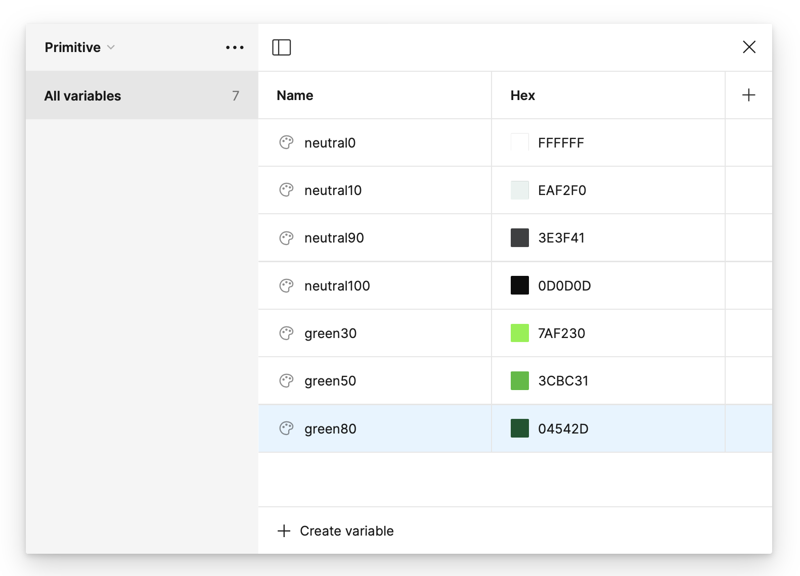
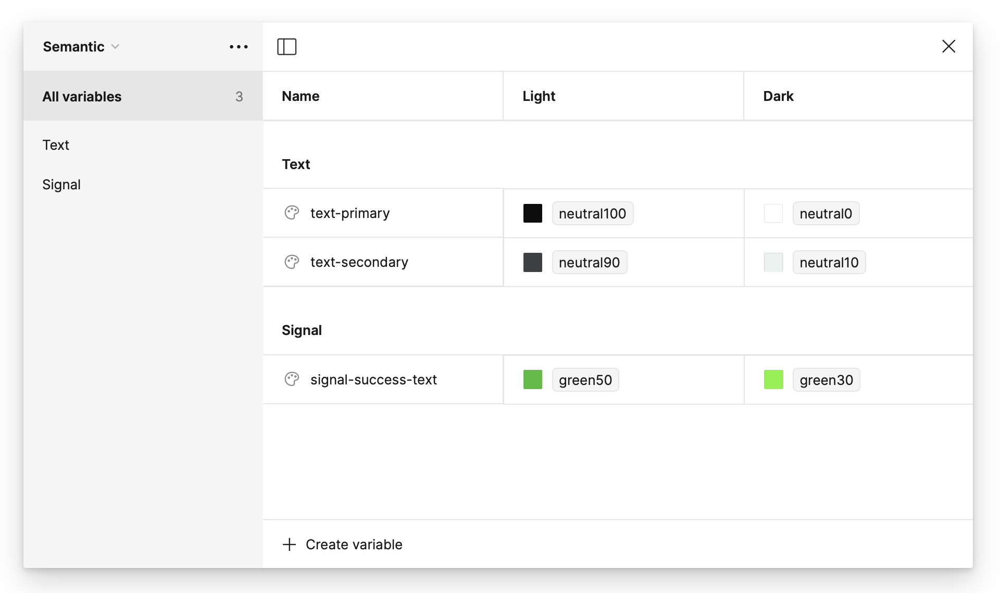
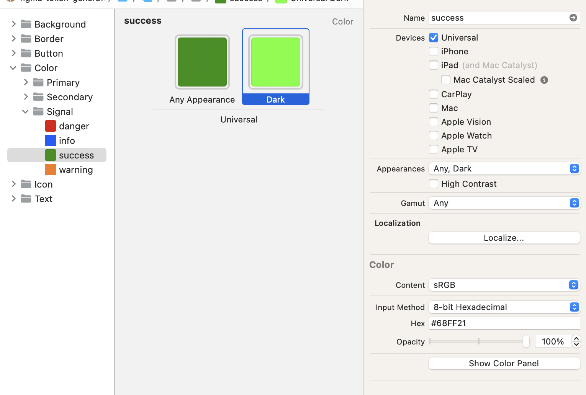

*This article explains how Figma stores colors, how Xcode handles them differently, and why keeping them in sync can be challenging.*
## **How Figma Stores Colors**

In **June 2023**, Figma introduced **Color Variables**, also called **tokens**, to better manage colors across designs.

There are two kinds of colors defined:

- **Primitive Color**
    - A base color defined by a static HEX value.
    - Example: `neutral0`, `green80`
- **Semantic Color**
    - A color named based on its **usage** rather than its actual color.
    - Example: `labelPrimary`, `labelSecondary`, `backgroundHighlighted`

**Primitive colors** are stored in Figma’s **Local Variables table** as name/HEX pairs:

**Semantic colors** reference **two primitive colors**—one for light mode and one for dark mode:

> **Note:** Instead of HEX values, semantic colors store references (aliases) to primitive colors. The two columns represent **color modes** (e.g., Light and Dark).

This system allows **global updates**—if a **primitive color changes**, all **semantic colors** that reference it update automatically.
## **How Xcode Handles Colors (Compared to Figma)**

At Infinum, we typically use **Asset Catalogs** to store **semantic colors** in Xcode. However, unlike Figma, Xcode’s **Asset Catalog does not support color references**—each color must be manually assigned a HEX value.

### **Why Is This a Limitation?**

- In **Figma**, changing a **primitive color** updates all **semantic colors** that reference it.
- In **Xcode**, since **semantic colors store HEX values directly**, any color change requires **manually updating all affected colors** in the Asset Catalog.

This makes color maintenance **time-consuming and error-prone**.

---

# **The Workflow**

Export → Push → Pull → Generate

### **1) Figma File Owners Export Colors**

After integrating their Figma project with a **GitHub storage repository**, Figma file owners can **export color data** for use in Colgen.

**Detailed info:**

- The export process uses the [Figma Tokens Studio Plugin](https://tokens.studio/).
- The colors are exported in **JSON format**, containing all **primitive and semantic colors**.
- The JSON file is **stored in a GitHub repo** as a central source of truth.
- **Exporting simply means committing the latest JSON file to this repo.**

**Instructions:** [Prepare Figma and Storage Repo](Readme_setup_prepare_figma.md)

> **Note:** The native Figma Variables feature does not yet support direct JSON exports, which is why we use a combination of a **plugin + GitHub repo**.

### **2) Developers Pull Colors into Xcode Using Colgen**

Once the designer **pushes the updated JSON** to GitHub, developers can run **Colgen** to fetch the latest colors and generate an **Xcode Asset Catalog** with all semantic colors.

**Instructions:** [Prepare Xcode Project for Colgen](Readme_setup_prepare_xcode.md)