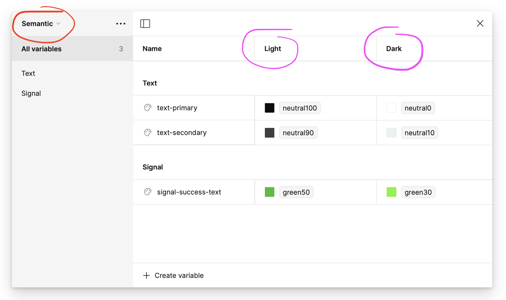

## Installation

As this tool is currently private, the first step is to create an access Token that you'll use to install the script and later fetch the color configuration JSON.

### Token

Github Personal Access token:
1. Create a GitHub [Personal Access Token](https://docs.github.com/en/authentication/keeping-your-account-and-data-secure/managing-your-personal-access-tokens) over at GitHub.
	1. Make sure it has access `repo`
2. Add the token your ZSHRC or BSHRC file under:
	1. `export COLGEN_TOKEN=...`
3. Restart Terminal to load token into the session

### Installation / Update

To install this tool, you have to run the following script:
```bash
git clone --quiet git@github.com:infinum/ios-figma-token-generator.git .colgen_tmp && sudo sh .colgen_tmp/install.sh
```

This script will fetch the latest executable from the repository and put it into the `/usr/local/bin.` For now, the same command should be run for the script update.

### Install specific version

If you want to install a specific version, just add the version after the `.sh)`:
```bash
git clone --quiet git@github.com:infinum/ios-figma-token-generator.git .colgen_tmp && sudo sh .colgen_tmp/install.sh v1.0.0
```

## Configuration

Before running it, you must configure Colgen for your project:

1. Create a `.colgen.yml` file in the root of your project
2. Copy and paste these contents into it:

```yml
projectName: {project_folder_name}
primitiveKey: {FigmaPrimitiveColumn/Name}
semanticLightKey: {FigmaSemanticColumn/Name}
semanticDarkKey: {FigmaSemanticColumn/Name}
xcassetsOutputPath: {Path/To/Generated/Colors.xcassets}
useNamespacing: {true/false}
shouldGenerateResolvedFiles: {true/false}
```

3. Populate the YML file with necessary parameters:
    - **projectName** - Folder name defined in `https://github.com/infinum/figma-token-storage` repo. If needed, create new folder in that repository before pushing tokens from Figma Token Studio. This is also the Github branch there. If branch is not already created, please create one. The name for folder and branch should be same, and it should be **same as the project repo name**, except platform prefix (e.g., if the project repo is `ios-clientname-projectname`, this value must be `clientname-projectname`). 
    - **primitiveKey / semanticLightKey / semanticDarkKey** - These are the columns names in Figma Variables table. Ask the designer for this, or inspect the JSON.
    - **xcassetsOutputPath**  - The path at which XCAssets will get created.
    - **useNamespacing** - (Optional) Translates color path on Figma to subfolders in XCAssets. Default=false. Read more below.
    - **shouldGenerateResolvedFiles**  - (Optional) "resolved" files are actually a list of all the generated colors in your project. Default=false. The list makes it easier to inspect and verify all the added/removed/modified semantic colors after running Colgen generate. Tip: you can disable this if you use Redbreast.
    
#### Tip: When to opt out of name spacing

If colors on Figma are organised in this hierarchy:
`Button/Branded/Primary/button-branded-primary`

This may result in unnecessary duplication on our side:
`= .Button.Branded.Primary.buttonBrandedPrimary`

 To fix this issue make sure to set `useNamespacing` to `false` so that only the last path component of the color is used actually used (must be unique for each color):
`= .buttonBrandedPrimary

### Example: YML file

```yml
projectName: someclient-coolproject
primitiveKey: Primitive/Mode 1
semanticLightKey: Semantic/Light Tokens
semanticDarkKey: Semantic/Dark Tokens
xcassetsOutputPath: Resources/Assets/Colors.xcasset
useNamespacing: false
shouldGenerateResolvedFiles: true
```


